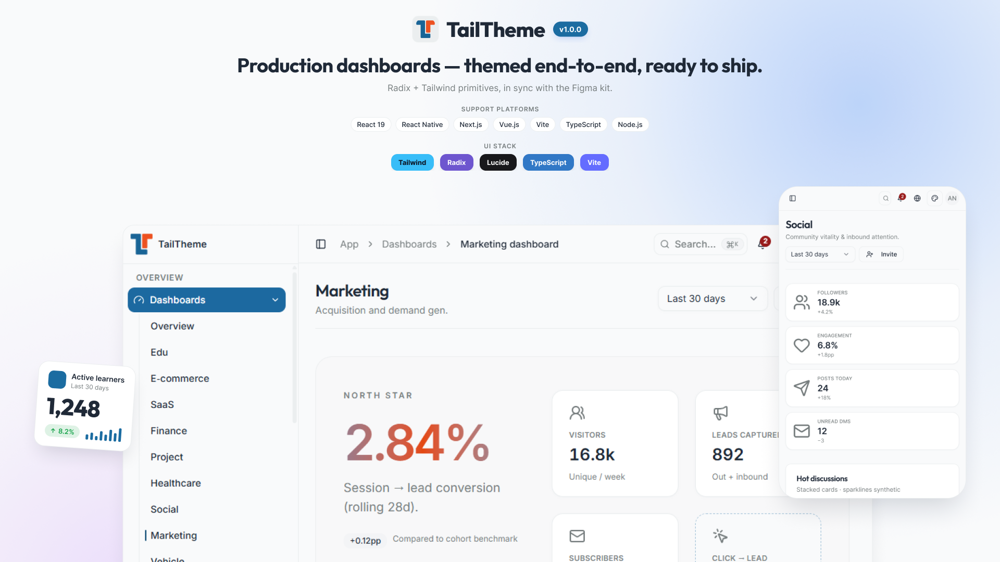

# TailTheme Free — Free React Admin Dashboard Template

TailTheme Free is a high-quality, open-source, and **free React admin dashboard template** built for modern product teams. Use it to ship data-rich backends, SaaS consoles, and internal tools with accessible UI, design tokens, and a production-ready app shell.

## Overview

TailTheme Free gives you the essential UI components, layouts, and sample pages needed to build feature-rich admin experiences. It is a subset of the commercial **TailTheme Pro** template, released under the MIT license.

Built with:

- **React 19**
- **TypeScript**
- **Vite 6**
- **Tailwind CSS v4**
- **Radix UI** + **shadcn-style** primitives
- **React Router 7**

### Quick links

- [✨ Visit website](https://tailtheme.dev)
- [📄 Developer guide](./GUIDE.md) — source layout, scripts, format, lint, and tests
- [⬇️ Get TailTheme Pro](https://tailtheme.dev/pro)
- [📋 Changelog](https://tailtheme.dev/changelog)

### Demos

After you start the dev server (see [GUIDE.md](./GUIDE.md)):

| Route | Description |
| ----- | ----------- |
| [http://localhost:5173/landing](http://localhost:5173/landing) | Marketing landing |
| [http://localhost:5173/app/dashboard](http://localhost:5173/app/dashboard) | Overview dashboard |
| [http://localhost:5173/auth/login](http://localhost:5173/auth/login) | Auth — sign in |

### Related product

- [**TailTheme Pro**](https://tailtheme.dev/pro) — full template (9 dashboards, 11 verticals, CRM, i18n, MSW demo mode, Figma kit, commercial license)

## What's included

TailTheme Free is a ready-to-customize starting point for React admin apps. The template includes:

- **App shell** — collapsible sidebar, top header, breadcrumbs, command palette (⌘K)
- **3 dashboards** — Overview, SaaS, Project
- **Sample verticals** — SaaS (analytics, members, calendar) and Project (kanban, projects, tasks)
- **30+ UI primitives** — buttons, forms, tables, dialogs, tabs, toasts, and more
- **Design tokens** — semantic colors, typography, spacing, radius, shadows (light/dark)
- **Auth screens** — login, register, forgot password
- **Settings** — profile, account, appearance
- **Marketing pages** — landing, pricing, about, contact
- **Quality tooling** — ESLint, Prettier, Husky, Vitest, Playwright (aligned with Pro workflow)

## Feature comparison

### TailTheme Free (this repo)

- MIT license
- 3 dashboards
- 2 verticals (SaaS, Project)
- 30+ UI primitives
- 4 theme presets
- English locale
- ESLint, Prettier, Husky, unit + E2E test scaffolding
- Community / self-serve support

### TailTheme Pro

- Commercial license
- 9 dashboards across 11 verticals + CRM
- 40+ UI primitives and patterns
- 16 theme presets
- i18n (EN, VI, FR)
- MSW demo mode, mini-apps, Figma design file
- Priority updates and support

[Compare plans and pricing →](https://tailtheme.dev/pro)

## Update logs

### Version 0.3.1

- TailTheme Free MIT release aligned with TailTheme Pro shell (sidebar layout, scroll regions, loading splash).
- App routes for dashboards, SaaS/Project samples, UI showcase, and auth.
- Developer tooling: ESLint (flat config + file naming rules), Prettier, Husky + lint-staged, Vitest, Playwright smoke/a11y specs.
- [GUIDE.md](./GUIDE.md) for source overview, install, and day-to-day commands.

For Pro release history, see the [TailTheme changelog](https://tailtheme.dev/changelog).

## License

TailTheme Free is released under the [MIT License](./LICENSE).

## Support

If this template helps your project, consider starring the repository and upgrading to [TailTheme Pro](https://tailtheme.dev/pro) when you need the full kit.

For development, start with **[GUIDE.md](./GUIDE.md)**.
